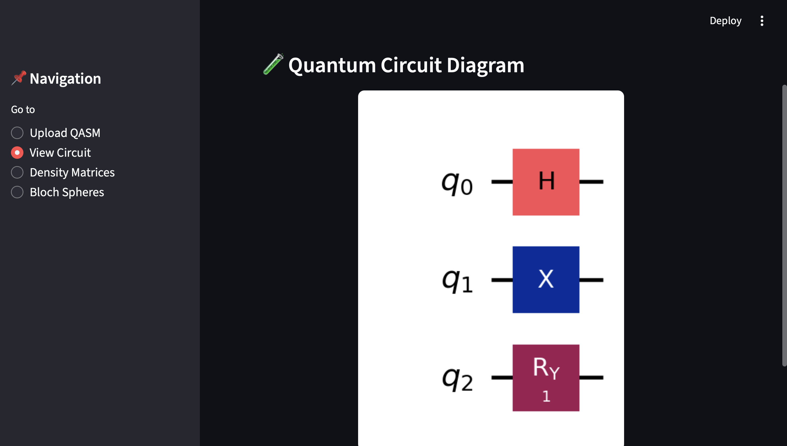
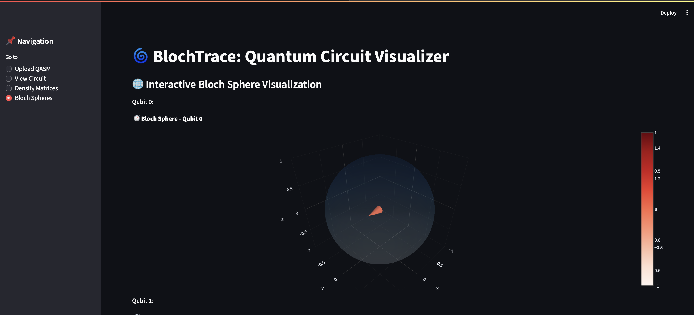

# 🌀 BlochTrace: Quantum Circuit Visualizer
### 🖼 Circuit Diagram Preview

**BlochTrace** is an interactive, Streamlit-based quantum circuit visualizer built using **Qiskit**, **Plotly**, and **NumPy**. It enables users to **upload any QASM file**, view the corresponding **quantum circuit diagram**, compute **single-qubit reduced density matrices**, and **visualize qubit states on Bloch spheres**. 

This tool bridges classical interactivity with quantum computing concepts by helping students, educators, and researchers visualize and interpret quantum states dynamically.

---

### 🌐 Bloch Sphere Preview

## ⚙️ What This Project Does

BlochTrace performs the following tasks:

1. **Upload a `.qasm` file**: Users can upload a valid OpenQASM quantum circuit file.
2. **Circuit Visualization**: Renders the uploaded quantum circuit using Qiskit’s Matplotlib drawer.
3. **Partial Trace Calculation**: Calculates the reduced density matrix for each qubit using `qiskit.quantum_info.partial_trace()`.
4. **Density Matrix Display**: Shows reduced 2x2 density matrices (ρ) for all individual qubits.
5. **Bloch Sphere Visualization**: Converts each qubit’s reduced state into a 3D Bloch vector and renders it using **Plotly** for interactive exploration.

---

## 🧱 Tech Stack

| Component      | Technology             |
|----------------|------------------------|
| 🧠 Quantum Backend | [Qiskit](https://qiskit.org/) (IBM) |
| 🖥 Web UI        | [Streamlit](https://streamlit.io/) |
| 📊 Visualization | [Plotly](https://plotly.com/python/) & Matplotlib |
| 🧮 Math/Linear Algebra | NumPy |
| 🗃 File Handling | Python datetime, file I/O |
| 🧪 Optional Pre-built Circuit | Bell/GHZ Circuit (`sample_circuits.py`) |

---

## 🖥 Screenshots

| Quantum Circuit | Density Matrix | Bloch Sphere |
|-----------------|----------------|--------------|
|  |  |  |

> (Add images inside an `assets/` folder and update the paths above)

---

## 🚀 How to Run BlochTrace on Your Local Machine

### 1. Clone the Repository

git clone https://github.com/rochitl72/BlochTrace.git
cd BlochTrace

2. Create Virtual Environment
python3 -m venv .venv
source .venv/bin/activate   # On Windows: .venv\Scripts\activate

3. Install Required Packages
   pip install -r requirements.txt
   If requirements.txt is missing, run:
   pip install streamlit qiskit plotly numpy matplotlib pylatexenc

4. Launch the Streamlit App
   streamlit run streamlit_app/app.py

📁 Project Folder Structure
BlochTrace/
│
├── streamlit_app/
│   └── app.py                 # Main Streamlit UI
│
├── src/
│   ├── circuits/
│   │   └── sample_circuits.py # GHZ/Bell circuit generator
│   └── utils/
│       └── partial_trace.py   # Reduced density matrix logic
│
├── uploaded_qasm/             # Uploaded QASM files saved with timestamp
├── assets/                    # Screenshots or illustrations for README
├── requirements.txt
└── README.md

📦 Sample QASM File (Optional)
OPENQASM 2.0;
include "qelib1.inc";
qreg q[3];
h q[0];
cx q[0],q[1];
cx q[1],q[2];

🧠 Educational Use-Cases
	•	Quantum computing education tools
	•	Bloch sphere interpretation
	•	Teaching QASM and quantum state decomposition
	•	Circuit debugging and visualization

⸻

